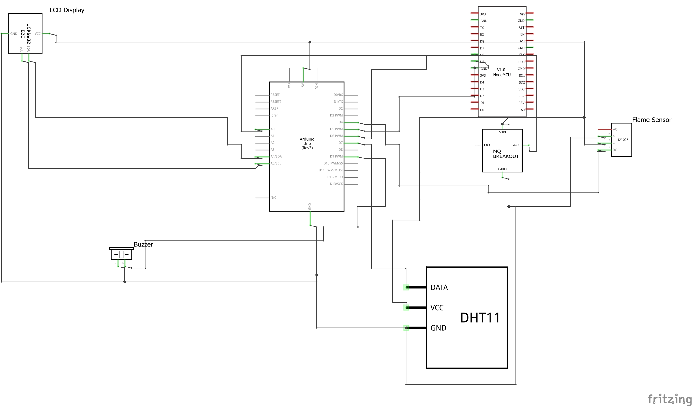

# Arduino-Fire-Safety-System-with-NodeMCU

<i>Home fires have become very rampant and a very disturbing issue. They cause extreme damage including the loss of lives and property. Most home fires are caused by the carelessness or negligence of home owners and are greatly catalysed by other environmental parameters. Gas leakages and indiscriminate smoking are the major causes of such disasters and there has been a lot of sensitization and education by organizations and the fire department as to how to prevent these incidents from occurring. There has also been some technological implementation like the installation of smoke detectors in our homes but these have proven to be quite useful to an extent. But these technologies only alert when the fire has already started and probably spread over a greater perimeter of the home. A system is then required to be able to detect the possibility of this fire disaster before they even start or at least detect them early enough so action can be taken to contain it before it gets out of hand.</i>

